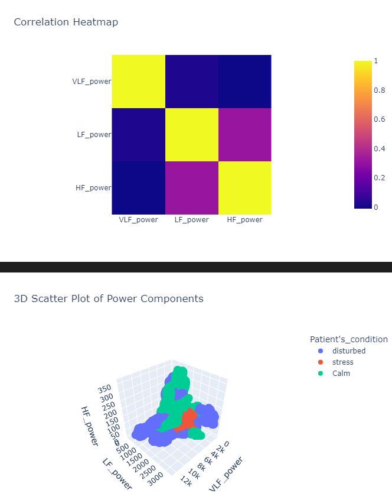
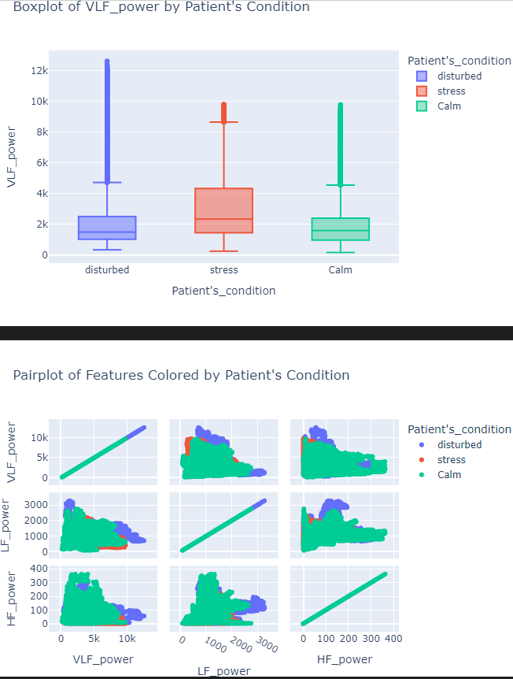

# Heart Rate Forecasting

## **Project Overview**
Accurate heart rate forecasting plays a crucial role in fields like healthcare, fitness monitoring, and wearable technology. This project aims to develop a predictive model for forecasting heart rate using heart rate variability (HRV) data and related features. By leveraging machine learning and time-series techniques, the goal is to predict future RR intervals or heart rate values, providing insights into physiological and psychological states.

---

## **Dataset Description**

### **Features**
The dataset consists of various time-domain, frequency-domain, and nonlinear HRV features, along with categorical labels indicating the patient's condition. Below is a detailed explanation of each feature:

| Feature Name                      | Description                                                                                          |
|-----------------------------------|------------------------------------------------------------------------------------------------------|
| **VLF_power**                     | Power in the very low-frequency range (0.0033-0.04 Hz). Associated with long-term physiological processes. |
| **VLF_component(%)**              | Proportion of VLF power in the total HRV spectrum.                                                  |
| **LF_power**                      | Power in the low-frequency range (0.04-0.15 Hz), linked to sympathetic nervous system activity.      |
| **LF_component(%)**               | Proportion of LF power in the total HRV power.                                                      |
| **LF_normalized_units**           | Normalized LF power, indicating sympathetic tone.                                                   |
| **HF_power**                      | Power in the high-frequency range (0.15-0.4 Hz), associated with parasympathetic activity.          |
| **HF_component(%)**               | Proportion of HF power in the total HRV power.                                                      |
| **HF_normalized_units**           | Normalized HF power, reflecting parasympathetic tone.                                               |
| **Total_RR_interval_power**       | Total power of the RR interval spectrum, a key measure of overall HRV.                              |
| **LF_to_HF_ratio**                | Ratio of LF to HF power, indicating the balance between sympathetic and parasympathetic activity.    |
| **HF_to_LF_ratio**                | Inverse ratio of LF to HF power.                                                                    |
| **Poincaré_plot_SD_perpendicular** | Standard deviation of the perpendicular axis in the Poincaré plot, reflecting HRV complexity.         |
| **Poincaré_plot_SD_along_identity**| Standard deviation along the identity axis in the Poincaré plot, indicative of short-term HRV.        |
| **sampen**                        | Sample entropy, a measure of regularity and complexity in the time series.                          |
| **Higuchi_fractal_dimension**     | Nonlinear measure indicating the fractal dimension of the HRV time series.                         |
| **Average_RR_intervals**          | Mean of RR intervals, reflecting heart rate regularity.                                             |
| **Median_RR_intervals**           | Median value of RR intervals, robust to outliers.                                                  |
| **RR_interval_variability**       | Variation in RR intervals, a measure of HRV.                                                       |
| **rms_RR_differences**            | Root mean square of differences between successive RR intervals.                                    |
| **Variation_RR_differences**      | Variation in successive RR interval differences.                                                   |
| **SDRR_to_RMSSD_ratio**           | Ratio of SDRR to RMSSD, indicating autonomic balance.                                               |
| **RR_differences>25ms(%)**        | Percentage of RR differences greater than 25 ms.                                                   |
| **RR_differences>50ms(%)**        | Percentage of RR differences greater than 50 ms.                                                   |
| **RR_interval_kurtosis**          | Kurtosis of RR interval distribution, indicating abnormal distributions.                           |
| **RR_interval_skewness**          | Skewness of RR interval distribution, indicating symmetry or asymmetry.                            |
| **Average_relative_RR_intervals** | Average of normalized RR intervals.                                                                |
| **Median_relative_RR_intervals**  | Median of normalized RR intervals.                                                                 |
| **Relative_RR_variability**       | Variability in normalized RR intervals.                                                            |
| **RMS_of_relative_RR_differences**| Root mean square of differences in normalized RR intervals.                                        |
| **Variation_of_relative_RR_differences**| Variation in differences between successive normalized RR intervals.                          |
| **Patient's_condition**           | Categorical variable indicating the condition (e.g., Calm, Stressed, Disturbed).                    |

---

### **Target Variable**
The target variable for this project is defined as:

1. **Future RR Interval**: Predicting the next RR interval (time between two successive heartbeats) based on historical data and features. This is essential for real-time forecasting in wearable devices.

2. **Derived Heart Rate**: The heart rate can be derived from the predicted RR interval using the formula:
   
   ```
   Heart Rate (BPM) = 60 / Mean RR Interval (seconds)
   ```

Both approaches provide insights into physiological states and are useful in various applications like stress monitoring, arrhythmia detection, and fitness tracking.

---

## **Exploratory Data Analysis (EDA)**

### Steps Taken:
1. **Initial Inspection**:
   - Checked for missing values, data types, and statistical summaries.

2. **Data Cleaning**:
   - Renamed columns for clarity (e.g., handling special characters in `Poincaré`).
   - Addressed missing or inconsistent values.

3. **Visualization**:
   - Histogram and box plots for feature distribution.
   - Correlation heatmap to analyze relationships between features.
   - Time-series plots of RR intervals to inspect trends and anomalies.

4. **Outlier Detection**:
   - Used Z-scores and IQR methods to identify and handle outliers.

5. **Feature Scaling**:
   - Normalized numerical features to ensure consistent ranges.




---

## **Modeling**

### **Approach**
The project uses a **time-series forecasting approach** to predict future RR intervals. Some key modeling steps include:

1. **Data Splitting**:
   - Training, validation, and test splits based on time-order to avoid data leakage.

2. **Feature Engineering**:
   - Lag-based features for RR intervals.
   - Rolling statistics (e.g., moving averages, standard deviation).

3. **Algorithms**:
   - Baseline: Linear Regression.
   - Advanced: LSTM (Long Short-Term Memory) networks for sequential modeling.

4. **Evaluation Metrics**:
   - **Mean Absolute Error (MAE)**.
   - **Root Mean Square Error (RMSE)**.
   - **R-Squared (R²)** for regression performance.

---

## **Applications**

1. **Healthcare**: Early detection of arrhythmias, monitoring stress levels, and assessing autonomic dysfunction.
2. **Wearable Technology**: Enhancing real-time HR forecasting in smartwatches and fitness trackers.
3. **Fitness**: Tracking recovery and exertion levels during workouts.
4. **Stress Management**: Identifying physiological stress markers for interventions.

---

## **How to Run the Project**

### Prerequisites
1. Install Python 3.8 or higher.
2. Required libraries:
   ```bash
   pip install pandas numpy matplotlib seaborn scikit-learn tensorflow
   ```

### Steps
1. Clone the repository:
   ```bash
   git clone <repository_url>
   cd heart-rate-forecasting
   ```
2. Load the dataset into the `data/` directory.
3. Run the preprocessing and EDA script:
   ```bash
   python eda_and_cleaning.py
   ```
4. Train the model:
   ```bash
   python train_model.py
   ```
5. Evaluate the model:
   ```bash
   python evaluate_model.py
   ```

---

## **Acknowledgments**
Special thanks to domain experts and resources for providing insights into HRV analysis and its importance in healthcare and fitness applications.

---

## **Future Work**
1. Incorporate additional features like accelerometer data to improve predictions.
2. Implement real-time forecasting for deployment in wearable devices.
3. Explore advanced architectures like Transformer models for time-series forecasting.

---

## **Contact**
For questions or contributions, please reach out via:
- Email: [kishanrajoria@gmail.com]
